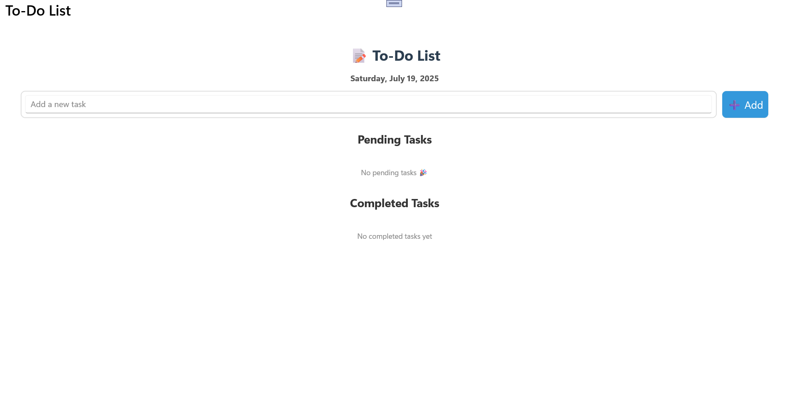
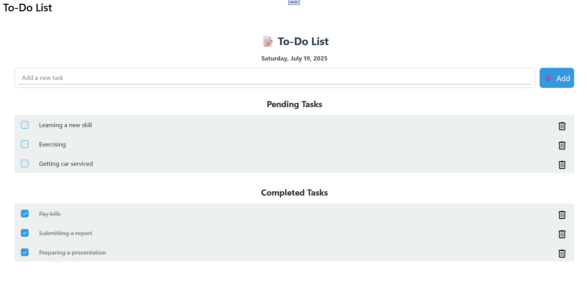
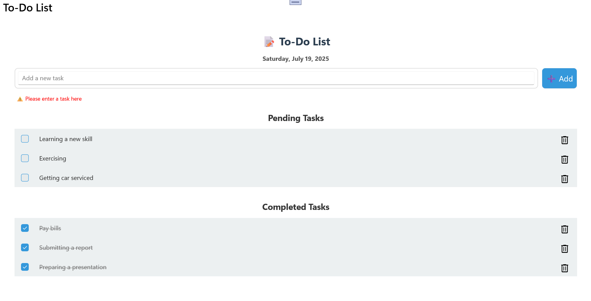

# .NET MAUI To-Do List App 📝

This is a simple and clean To-Do List app built with **.NET MAUI**.  
It supports Android deployment with a focus on offline-first task management.

## 📱 Features
- Add new tasks
- Mark tasks as complete
- Delete tasks
- Persistent storage using Preferences

## 🔧 Tech Stack
- .NET MAUI (.NET 9)
- C#
- XAML UI
- Android platform (for now) 

## 🧪 Screenshots

**No Tasks**
 

**Added Tasks**
 

**Validation**
 


## 🚀 Getting Started (Developers)

```bash
git clone https://github.com/yourusername/maui-todo-list.git
cd maui-todo-list
